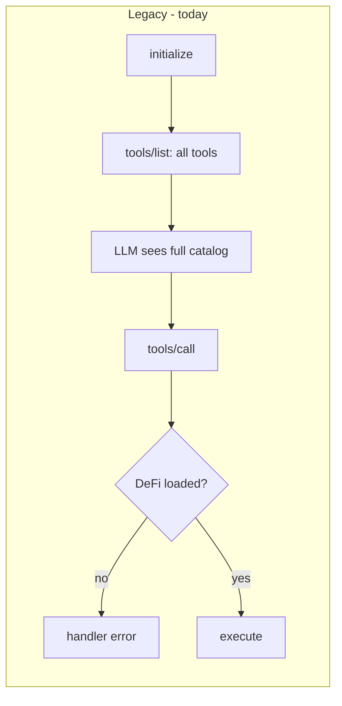
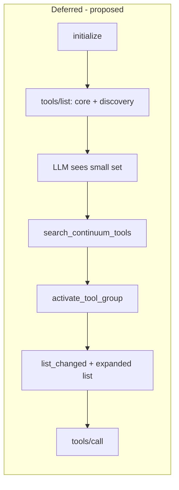
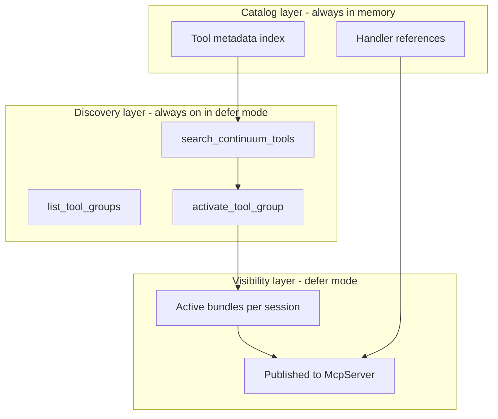
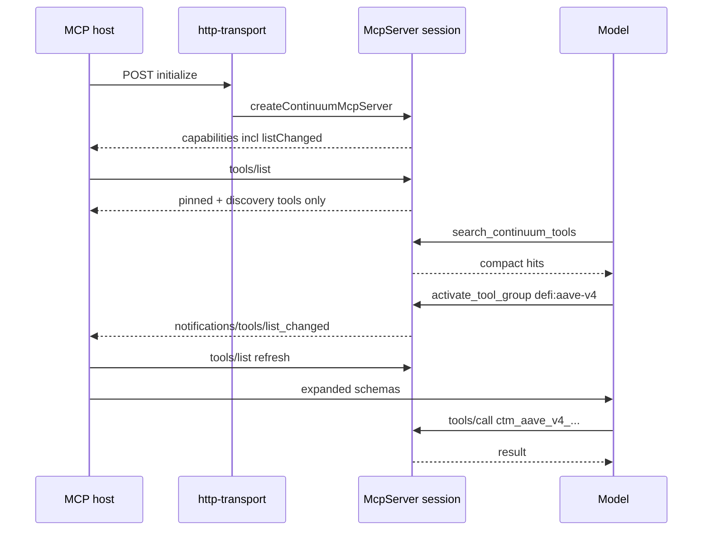

# MCP deferred tool loading (design)

Design for optional deferred tool loading on **continuum-mcp-server** (`continuum-node-sdk` MCP entrypoint). This document is specification-only; implementation is tracked separately.

**Related references**

- [Anthropic — Advanced tool use](https://www.anthropic.com/engineering/advanced-tool-use) (Tool Search / `defer_loading` — conceptual analogue)
- [MCP TypeScript SDK](https://github.com/modelcontextprotocol/typescript-sdk) (dynamic tools, `tools/list_changed`)
- Current server: `src/mcp/register.ts`, DeFi: `src/mcp/defi/`

---

## 1. Executive summary

The Continuum MCP server exposes a large, mostly static `tools/list` (on the order of **~96** explicitly registered tools in `src/mcp/**/*.ts`, plus **one registration per DeFi catalog tool** from `@continuumdao/ctm-mpc-defi`). DeFi already uses a **load gate** at execution time (`load_defi_protocol` → `DefiProtocolContext.assertToolCallable`), but **tool schemas still appear in `tools/list`** for every client session.

**Deferred loading (trial mode)** adds an opt-in path where:

1. Only a **pinned core** plus **discovery tools** appear in `tools/list` initially.
2. The model **searches** a compact in-memory catalog and **activates** tool bundles.
3. Activated tools become visible via MCP **`notifications/tools/list_changed`** (capability already advertised).
4. **Legacy mode** (default) keeps today’s behavior unchanged.

Configuration is a single flag (`MCP_DEFER_LOADING` / `deferLoading`), default **off**.

---

## 2. Current architecture

### 2.1 Server bootstrap

| Component | Role |
|-----------|------|
| `src/mcp/server/index.ts` | Reads env config, starts HTTP transport |
| `src/mcp/server/http-transport.ts` | Streamable HTTP; **creates a new `McpServer` per `initialize` session** |
| `src/mcp/register.ts` | `createContinuumMcpServer`, `registerContinuumTools`, `listChanged: true` |
| `src/mcp/server/config-from-env.ts` | `NodeSdkConfig` from `MPC_AUTH_*`, signer paths |

### 2.2 Tool registration order

`registerContinuumTools` registers, in order:

1. Node — `src/mcp/node.ts` (8 tools)
2. Group — `src/mcp/group.ts` (4)
3. Management signer — `src/mcp/management-signer.ts` (8)
4. Keygen — `src/mcp/keygen.ts` (9)
5. Keygen messaging — `src/mcp/keygen-messaging.ts` (8)
6. Registries — address book, tokens, chains (3 each)
7. MPC — `src/mcp/mpc.ts` (25)
8. Agent — MCP servers, env vars, cron, webhooks, skills (28 total across modules)
9. DeFi (when `defiContext` present):
   - Discovery — `src/mcp/defi/discovery.ts` (6)
   - All protocol tools — `src/mcp/defi/register-protocol-tools.ts` (loop over `getMcpToolDefinitions()`)

### 2.3 DeFi load gate (execution only)

```text
Session initialize
  → tools/list includes ALL DeFi tool definitions
  → tools/call on ctm_* without load
       → handler runs assertToolCallable
       → error: "Call load_defi_protocol first"
  → load_defi_protocol
       → DefiProtocolContext.markLoaded
       → sendToolListChanged (notification only; tools were already listed)
```

`unload_defi_protocol` clears session context but **does not remove tools from `tools/list`** (documented as “soft unload” in `discovery.ts`).

### 2.4 Session isolation

Each Streamable HTTP session calls `createContinuumMcpServer(config)` on initialize (`http-transport.ts`). `DefiProtocolContext` is **per session** — deferred activation state can reuse the same scope without cross-client leakage.

### 2.5 Current vs desired (diagram)





---

## 3. Legacy vs deferred modes

| Aspect | Legacy (default) | Deferred (trial) |
|--------|------------------|------------------|
| Flag | `MCP_DEFER_LOADING` unset / `false` | `MCP_DEFER_LOADING=1` or `true` |
| `tools/list` at init | All registered tools | Core + discovery + env-pinned bundles only |
| DeFi without load | Callable in list; **fails at handler** | **Not listed**; call should fail as unknown/disabled |
| DeFi load | `load_defi_protocol` sets context | Same + **activates visibility** for `defi:<protocolId>` |
| Unload | Context cleared; tools still listed | Context cleared; tools **hidden** from list again |
| Discovery | DeFi-only (`list_defi_protocols`, …) | General + DeFi aliases |

**Principle:** Legacy mode must remain **bit-for-bit equivalent** in observable behavior for existing hosts (same tool names, same handler errors for unloaded DeFi).

---

## 4. Three-layer architecture



### 4.1 Catalog layer (internal)

**Responsibility:** Single source of truth for every tool the server can run.

Each catalog entry should include at minimum:

| Field | Purpose |
|-------|---------|
| `name` | MCP tool name |
| `description` | Full description (may include prerequisites, gas guidance) |
| `inputSchema` / `outputSchema` | Zod / JSON schema for MCP |
| `group` | Bundle id (see §6) |
| `tags` | Optional search tokens (protocol, chain, action verb) |
| `handler` | Existing SDK/MCP callback |
| `deferDefault` | Whether tool starts hidden in defer mode |

**Population:** Refactor existing `register*Tools` functions to register into the catalog first; legacy mode immediately publishes all entries to `McpServer.registerTool` as today. No duplicate business logic.

### 4.2 Visibility layer (defer mode only)

**Responsibility:** Control which catalog entries appear in `tools/list` and accept `tools/call`.

**Alignment with [@modelcontextprotocol/typescript-sdk](https://github.com/modelcontextprotocol/typescript-sdk):**

1. **Preferred:** Use `RegisteredTool` from `registerTool()` — `disable()` for deferred, `enable()` on activation, `remove()` on hard unload. SDK sends `notifications/tools/list_changed` automatically (see [PR #1857](https://github.com/modelcontextprotocol/typescript-sdk/pull/1857)).
2. **Fallback (v1.29 verify during implementation):** Lazy `registerTool` on activate; `remove()` on deactivate if `disable()` is unavailable.
3. **Manual `sendToolListChanged`:** Only for bulk changes the SDK cannot observe (e.g. env-pinned bundle preload at init). Avoid redundant calls after each `enable()` if automatic.

**Per-session state:** `ActiveBundles: Set<groupId>` plus existing `DefiProtocolContext` for protocol-specific metadata (skill preview, advisory tool names).

### 4.3 Discovery layer (MCP tools)

Always visible when `defer_loading=true` (part of `defi_discovery` + `core` pin group).

---

## 5. Discovery tool schemas (informal)

### 5.1 `list_tool_groups`

**Input:** `{}`

**Output:**

```json
{
  "groups": [
    {
      "groupId": "core",
      "description": "Node health, version, connectivity",
      "toolCount": 8,
      "loaded": true,
      "pinned": true
    },
    {
      "groupId": "defi:aave-v4",
      "description": "Aave v4 multisign builders and quotes",
      "toolCount": 42,
      "loaded": false,
      "pinned": false
    }
  ]
}
```

### 5.2 `search_continuum_tools`

**Input:**

```json
{
  "q": "aave deposit multisign",
  "group": "defi",
  "limit": 20
}
```

- `q` (required): search string
- `group` (optional): filter to group id prefix (`defi`, `mpc`, `mpc_read`, …)
- `limit` (optional): default 20, max 50

**Output:**

```json
{
  "hits": [
    {
      "name": "ctm_aave_v4_build_deposit_multisign",
      "shortDescription": "Build Aave v4 deposit multisign request",
      "group": "defi:aave-v4",
      "loaded": false,
      "score": 0.92
    }
  ],
  "suggestion": "Call activate_tool_group with groupId \"defi:aave-v4\" to enable these tools."
}
```

**Search algorithm (trial):** Case-insensitive token overlap on `name`, `description`, `group`, `tags`. Rank by: exact name match > prefix > token coverage. Document upgrade path to BM25 or embeddings if recall is insufficient.

### 5.3 `activate_tool_group`

**Input:**

```json
{
  "groupId": "defi:aave-v4"
}
```

**Output:**

```json
{
  "activated": true,
  "groupId": "defi:aave-v4",
  "toolNames": ["ctm_aave_v4_build_deposit_multisign", "..."],
  "advisoryTools": [
    "get_defi_protocol_supported_chains",
    "get_defi_protocol_supported_tokens",
    "get_defi_protocol_skill"
  ],
  "skillPreview": "...",
  "skillHint": "Call get_defi_protocol_skill for full SKILL.md workflow guidance."
}
```

Idempotent if already active. Triggers tool list visibility update + notification.

### 5.4 `deactivate_tool_group` (optional explicit tool)

Mirrors unload; input `{ "groupId": "defi:aave-v4" }`. If omitted, `unload_defi_protocol` remains the DeFi-facing alias.

### 5.5 Legacy aliases (same handlers)

| Legacy tool | Maps to |
|-------------|---------|
| `list_defi_protocols` | `list_tool_groups` filtered to `groupId` matching `defi:*` |
| `load_defi_protocol` | `activate_tool_group({ groupId: "defi:" + protocolId })` |
| `unload_defi_protocol` | `deactivate_tool_group` / visibility off for `defi:<protocolId>` |

Aliases stay registered in **both** modes for backward compatibility; in legacy mode they only affect `DefiProtocolContext`, not visibility.

---

## 6. Tool group catalog

Proposed bundle ids and default pin policy when `defer_loading=true`:

| Group ID | Source module(s) | Tool count (static) | Pinned at init? | Rationale |
|----------|------------------|---------------------|-----------------|-----------|
| `core` | `node.ts` | 8 | Yes | Health, version, logs — always needed |
| `management_signer` | `management-signer.ts` | 8 | Yes | Signing setup before most workflows |
| `group` | `group.ts` | 4 | Yes | Group formation loop |
| `defi_discovery` | `defi/discovery.ts` + new discovery tools | 6+ | Yes | Find/load protocols without full DeFi list |
| `mpc_read` | subset of `mpc.ts` | TBD | Recommended | List/query sign requests, statuses |
| `mpc_write` | subset of `mpc.ts` | TBD | No | Create, agree, sign, execute, transfers |
| `keygen` | `keygen.ts` | 9 | No | Activate when doing keygen; pin `get_preferred_key_gen` + `fetch_key_gen_result` for EVM executor lookups (`keygen.md`) |
| `keygen_messaging` | `keygen-messaging.ts` | 8 | No | Activate with keygen workflows |
| `registry` | `registry/*` | 9 | No | Address book, tokens, chains |
| `agent` | `agent-*.ts` | 28 | No | MCP servers, webhooks, cron, skills, env |
| `defi:<protocolId>` | `ctm-mpc-defi` catalog | Per protocol | No | One bundle per protocol (today’s load unit) |

**Pin rule:** Target **3–5 pinned groups** for a typical node-operator session: `core`, `management_signer`, `group`, `mpc_read` (optional), `defi_discovery`. For chat that answers “preferred KeyGen Ethereum address”, pin `get_preferred_key_gen` and `fetch_key_gen_result` so models do not Keccak-hash `pubKey`.

### 6.1 Suggested `mpc_read` vs `mpc_write` split

Assign during Phase C implementation using `src/mcp/resources/mpc.md` workflows:

- **Read:** list/get/query tools (sign request status, pending agreements, machine info tied to MPC state).
- **Write:** create, agree, sign, execute, bump, transfer builders — anything that posts signed management bodies.

Exact name→group mapping should be generated in Phase A inventory (script over registrars).

### 6.2 DeFi groups

- One group per `protocolId` from `getProtocolModules()` / `tool.protocolId`.
- Catalog metadata comes from `getMcpToolDefinitions()` (`@continuumdao/ctm-mpc-defi/agent`).
- Non-submit tools (`MCP_NON_SUBMIT_TOOL_NAMES` in `catalog-adapter.ts`) stay in the same group; descriptions already carry gas/API-key guidance.

---

## 7. MCP SDK alignment (v1 vs v2)

**Current dependency:** `@modelcontextprotocol/sdk` ^1.29.0 (`package.json`).

| Capability | v1 (current) | v2 (future) |
|------------|--------------|-------------|
| `tools.listChanged` | Advertised in `createContinuumMcpServer` | Same |
| `sendToolListChanged()` | Used on init + `load_defi_protocol` | Prefer automatic notifications |
| `RegisteredTool.enable/disable` | **Verify at implementation** | Documented in v2 server guide |
| Lazy `registerTool` | Fallback | Composable with enable/disable |

**Implementation checklist:**

1. Inspect `registerTool` return type in installed v1.29.
2. If `disable`/`enable` exist → use visibility toggles.
3. Else → lazy register + `remove` on deactivate.
4. Plan Phase D upgrade to v2 when stable ([SDK main branch](https://github.com/modelcontextprotocol/typescript-sdk) notes pre-alpha v2 targeting 2026).

**Do not** rely on Anthropic `defer_loading` JSON fields — those apply to Claude Messages API, not MCP wire protocol.

---

## 8. Session-per-transport behavior



**Implications:**

- Deferred state **resets** on new session (new initialize) — acceptable; hosts should re-activate bundles per conversation if needed.
- No shared global “loaded protocols” across HTTP sessions.
- Pre-loaded protocols via `DefiProtocolContextOptions.loadedProtocols` should also activate visibility in defer mode.

---

## 9. Operator guide

### 9.1 Environment variables

| Variable | Default | Purpose |
|----------|---------|---------|
| `MCP_DEFER_LOADING` | `false` | Enable deferred trial mode |
| `MCP_HTTP_HOST` | `0.0.0.0` (Docker) | Bind address |
| `MCP_HTTP_PORT` | `8446` | Port |
| `MCP_HTTP_PATH` | `/mcp` | Path |

**Future (optional):**

| Variable | Purpose |
|----------|---------|
| `MCP_DEFER_PIN_GROUPS` | Comma list overriding default pinned groups |
| `MCP_DEFER_PRELOAD_GROUPS` | Activate groups at session init (e.g. `mpc_read`) |

### 9.2 Docker / mpc-config

See `src/mcp/local/README.md`. To trial deferred loading after implementation:

```bash
# Example — not active until code ships
docker run ... -e MCP_DEFER_LOADING=1 continuum-mcp:local
```

Add to compose merge under `continuum-mcp` service `environment` when ready.

### 9.3 Host guidance (system prompt)

When defer mode is on, recommend clients include:

```text
Continuum MCP uses deferred tools. Start with list_tool_groups or
search_continuum_tools. Call activate_tool_group before using tools in
that bundle. Refresh tools/list after list_changed notifications.
```

MCP resources (`docs://overview.md`, `docs://mpc.md`, …) remain the long-form onboarding path.

---

## 10. Host compatibility expectations

| Requirement | Notes |
|-------------|-------|
| `tools.listChanged` support | Required for good UX; server already advertises |
| React to `notifications/tools/list_changed` | Host should re-fetch `tools/list` |
| Token savings | **Not guaranteed** — if host caches full catalog or sends all tools every turn, defer mode helps server-side clarity only |

**Trial matrix (manual QA):**

| Host | Expectation |
|------|-------------|
| Cursor | Verify list refresh after activation |
| Claude Desktop | Same |
| Custom MCP client | Must implement list_changed handler |

**Future automated tests:**

- `defer_loading=false` → tool count equals today’s baseline.
- `defer_loading=true` → initial count = pinned + discovery only.
- After `activate_tool_group` → target tools in list and callable.
- After deactivate → tools absent from list; `tools/call` fails.

---

## 11. Anthropic Tool Search mapping (informative)

| Anthropic | Continuum MCP (proposed) |
|-----------|---------------------------|
| `defer_loading: true` on tool defs | Tool omitted from `tools/list` until bundle activated |
| `tool_search_tool_regex` / BM25 | `search_continuum_tools` |
| Search expands defs into model context | `activate_tool_group` + host refreshes list |
| MCP server `default_config.defer_loading` | Per-group defer in catalog (`deferDefault`) |
| Programmatic Tool Calling | Out of scope |
| `input_examples` | Out of scope (use MCP resources + skills today) |

**Caveat:** Anthropic optimizations apply inside Claude’s context window. MCP deferred loading reduces what **hosts expose** to the model, but only if the host honors dynamic lists.

---

## 12. Implementation phases

| Phase | Scope | Default mode |
|-------|-------|--------------|
| **A** | Catalog inventory script; tool→group map; this doc | — |
| **B** | DeFi-only defer + discovery tools; flag wiring | Legacy |
| **C** | `mpc_read`/`mpc_write`, `agent`, `registry`, `keygen` bundles | Legacy |
| **D** | SDK v2 `enable`/`disable` migration | Legacy |

**Phase B acceptance criteria:**

- `MCP_DEFER_LOADING=0` → unchanged tool list and DeFi errors.
- `MCP_DEFER_LOADING=1` → DeFi protocol tools hidden until `load_defi_protocol` / `activate_tool_group`.
- `list_changed` fired on activate/deactivate.

---

## 13. Configuration API (planned code)

Extend `CreateContinuumMcpServerOptions` in `src/mcp/defi/context.ts` (or a dedicated `src/mcp/options.ts`):

```typescript
export type CreateContinuumMcpServerOptions = {
  defiContext?: DefiProtocolContext;
  /** When true, hide deferred bundles from tools/list until activated. Default false. */
  deferLoading?: boolean;
  /** Override pinned group ids for defer mode. */
  pinnedGroups?: string[];
};
```

Wire from `nodeSdkConfigFromEnv()` or a dedicated `mcpOptionsFromEnv()` reading `MCP_DEFER_LOADING`.

---

## 14. Open questions / future work

1. **Unload semantics:** Prefer `disable()` (reversible, keeps handler) vs `remove()` (cleaner list, re-register on load)? Recommendation: `disable` when available; `remove` as fallback.
2. **MPC split granularity:** Single `mpc` bundle vs `mpc_read`/`mpc_write` — defer to Phase C inventory.
3. **Tool `_meta`:** Expose `{ "continuum/group": "defi:aave-v4", "continuum/deferred": true }` for hosts that learn to filter client-side if server-side hide is insufficient.
4. **Search quality:** Add protocol/action synonyms to catalog `tags` (e.g. “supply” → “deposit”).
5. **Cross-session preload:** Should mpc-config define default activated groups for operator profiles?
6. **Agent node catalog:** `list_mcp_servers` / `add_mcp_server_from_catalog` remains separate — not merged with continuum-mcp deferred catalog.

---

## 15. Summary

| Item | Decision |
|------|----------|
| Default behavior | Legacy unchanged |
| Trial flag | `MCP_DEFER_LOADING` / `deferLoading` |
| Primary win | Hide DeFi + large bundles from `tools/list` |
| Discovery | `list_tool_groups`, `search_continuum_tools`, `activate_tool_group` |
| DeFi compatibility | Keep `load_defi_protocol` / `unload_defi_protocol` |
| MCP SDK pattern | Dynamic visibility + `list_changed`; verify v1.29 `RegisteredTool` |
| Session scope | Per HTTP initialize (existing transport model) |

This design keeps continuum-mcp-server compatible with existing operators while enabling an Anthropic-style **search → activate → use** loop entirely within MCP.
