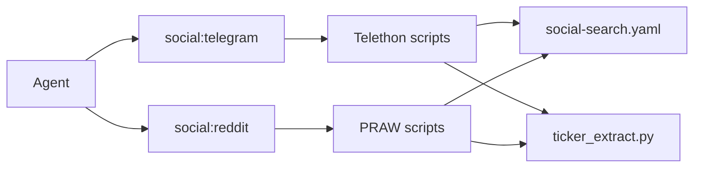

# Social media search MCP — unified YAML + Reddit

**Repo:** [`continuum-node-sdk`](../../) — extends existing Telegram search ([`telegram-message-search-mcp.md`](telegram-message-search-mcp.md)). Ships on **`continuum-mcp`** (same container as Telegram).

**Scope:** public Telegram channels + public Reddit subreddits; full post bodies; text search + shared ticker/token scan; **Reddit ranked reply context** via **`get_reddit_thread`** and optional **`include_comments`** on search tools. No Apify, no paid third-party scrapers.

**Not in scope (v1):** authenticated Reddit actions, DMs, posting, voting, private subreddits the app cannot read, cross-platform dedup, subreddit-wide comment search.

---

## Architecture



| Layer | Telegram (done) | Reddit (this plan) |
|-------|-----------------|---------------------|
| Tool group | `social:telegram` | `social:reddit` |
| Python | Telethon (`scripts/telegram-search/`) | PRAW (`scripts/reddit-search/`) |
| Auth | MTProto user session (`TELEGRAM_*`) | Reddit app credentials (`REDDIT_*`) |
| Sources | `telegram.channels[]` | `reddit.subreddits[]` |
| Shared | `defaults`, `tickers`, `ticker_detection` | same |

Activate bundle: **`activate_tool_group({ groupId: "social_search" })`** → both `social:telegram` and `social:reddit` (update alias from telegram-only).

---

## Why PRAW (v1)

Use **[PRAW](https://praw.readthedocs.io/)** (sync) for the first Reddit integration:

- Mature, widely used, MIT — fits the existing **spawn Python subprocess** model (`stdin` JSON → `stdout` JSON).
- Built-in **rate-limit handling** and Reddit API compliance (respects `Retry-After`, tracks remaining requests).
- Returns **full post objects** (`title`, `selftext`, `score`, `upvote_ratio`, `num_comments`, `created_utc`, `permalink`, …).
- **`submission.comments.replace_more(limit=…)`** + ranked/top comment fetch for **`get_reddit_thread`** and **`include_comments`** (read-only; depth/caps from YAML).

**asyncpraw** is a valid alternative if we later move to a long-lived async worker inside continuum-mcp; for v1 subprocess I/O, sync PRAW keeps parity with Telethon scripts.

**Reddit app:** operator creates a free **“script”** app at [reddit.com/prefs/apps](https://www.reddit.com/prefs/apps) (read-only public data; no user OAuth flow required for search/listing endpoints PRAW uses in read-only mode).

---

## Unified YAML — `social-search.yaml`

**Replace** [`telegram-channels.yaml`](../../src/mcp/resources/telegram-channels.yaml) with a single bundled file:

[`src/mcp/resources/social-search.yaml`](../../src/mcp/resources/social-search.yaml)

```yaml
defaults:
  max_results: 50

# Shared across Telegram + Reddit
tickers:
  - ETH
  - UNI
  - BTC

ticker_detection:
  min_length: 2
  max_length: 10
  include_bare_caps: true
  exclude:
    - THE
    - TVL
    - APR
    # … same blocklist as today

telegram:
  max_messages_per_channel: 500
  channels:
    - username: defillama
      category: analytics
    - username: uniswap
      category: dex

reddit:
  max_posts_per_subreddit: 100
  # Listing mode for ticker scan and for post browse when not using text search
  sort: new                   # new | top — platform default
  time_filter: month          # required when sort=top — hour | day | week | month | year | all
  subreddits:
    - name: ethereum
      category: l1
      sort: new               # optional override per subreddit
    - name: defi
      category: general
    - name: CryptoCurrency
      category: general
      sort: top
      time_filter: week       # optional override when sort=top
  # Ranked reply context (get_reddit_thread + include_comments on search tools)
  comments:
    include_on_search: false  # default off on search_reddit_posts / search_reddit_tickers
    max_per_post: 10          # top-N comments when include_comments=true
    max_per_thread: 200       # cap for get_reddit_thread (full thread fetch)
    max_depth: 3              # reply nesting depth (0 = top-level only)
    sort: top                 # top | best | new — PRAW comment sort for ranked snippets
    replace_more_limit: 0     # 0 = expand all "load more"; raise if rate-limit pain
```

**Loader rules:**

- Top-level **`defaults.max_results`**, **`tickers`**, **`ticker_detection`** apply to **both** platforms unless a tool param overrides.
- **`telegram.*`** and **`reddit.*`** are platform slices; missing section → empty source list (tool errors clearly).
- **`reddit.sort`**: **`new`** or **`top`** only (v1). Subreddit entries may override with their own **`sort`** / **`time_filter`**.
- When **`sort: top`**, **`time_filter`** is required at platform or subreddit level (default **`month`** at platform if omitted).
- Migrate existing parser/tests; keep minimal YAML parser (no new npm/pip yaml dep in TS).

**Reddit sort behaviour:**

| YAML `sort` | PRAW listing | Result order returned to agent |
|-------------|--------------|--------------------------------|
| **`new`** | `.new(limit=…)` | **`created_at` desc** (most recent first) |
| **`top`** | `.top(time_filter=…, limit=…)` | **`score` desc**, then **`created_at` desc** tie-break |

Both modes include **`score`**, **`upvote_ratio`** (when API provides it), and **`num_comments`** on each hit.

**Backward compat (one release):** loader accepts legacy `telegram-channels.yaml` if `social-search.yaml` absent (log deprecation); remove in follow-up.

---

## MCP tools — Reddit

Register in **`social:reddit`** (not pinned; recommended bundle with `social:telegram`).

### `search_reddit_posts`

Text search across configured subreddits (PRAW `subreddit.search` or multi-subreddit union).

| Parameter | Default | Description |
|-----------|---------|-------------|
| `query` | required | Search string |
| `subreddits` | YAML `reddit.subreddits` | Subreddit names (no `r/` prefix) |
| `max_results` | `defaults.max_results` | Cap after merge across subs |
| `max_posts_per_subreddit` | YAML | Scan depth per sub |
| `sort` | YAML `reddit.sort` or per-sub override | **`new`** or **`top`** |
| `time_filter` | YAML `reddit.time_filter` or per-sub override | Required when **`sort: top`** — `hour` … `all` |
| `since` | — | ISO date — client-side filter on `created_utc` |
| `include_comments` | YAML `reddit.comments.include_on_search` | Attach top-N ranked comments per post |
| `max_comments_per_post` | YAML `reddit.comments.max_per_post` | When **`include_comments: true`** |

**Returns:** `{ subreddit, post_id, title, selftext, score, upvote_ratio, num_comments, created_at, url, permalink, sort, comments? }[]` — ordered by **`created_at` desc** when `sort=new`, else **`score` desc**. Each **`comments[]`** entry (when included): `{ comment_id, parent_id, depth, body, score, created_at, author }` — flat list, **`depth`** preserved, sorted by **`score` desc** (YAML **`reddit.comments.sort`**).

When **`query`** is set, PRAW uses **`subreddit.search(query, sort=…, time_filter=…)`** where **`sort`** may be **`relevance`** (default for search) unless YAML/tool specifies **`new`** or **`top`** for listing-style browse without search API.

**`include_comments` flow:** after posts collected, for each hit (up to result cap), fetch top **`max_comments_per_post`** via shared **`comment_fetch.py`** (no full tree — snippets only). Skip if **`num_comments == 0`**.

### `get_reddit_thread`

Fetch **one post** plus **ranked reply context** (read-only). Use when search returned a **`post_id`** / **`permalink`** and the agent needs discussion, not just the OP.

| Parameter | Default | Description |
|-----------|---------|-------------|
| `post_id` | one of `post_id` / `permalink` required | Reddit base36 id |
| `permalink` | — | e.g. `/r/ethereum/comments/abc123/title/` |
| `max_comments` | YAML `reddit.comments.max_per_thread` | Total comments returned |
| `max_depth` | YAML `reddit.comments.max_depth` | Reply nesting (0 = top-level only) |
| `sort` | YAML `reddit.comments.sort` | **`top`**, **`best`**, or **`new`** |
| `replace_more_limit` | YAML `reddit.comments.replace_more_limit` | PRAW **`replace_more`** cap |

**Returns:**
```json
{
  "post": {
    "subreddit", "post_id", "title", "selftext", "score", "upvote_ratio",
    "num_comments", "created_at", "url", "permalink"
  },
  "comments": [
    { "comment_id", "parent_id", "depth", "body", "score", "created_at", "author" }
  ]
}
```

**PRAW flow (`get_thread.py`):**
1. Load submission by **`post_id`** or **`permalink`**.
2. **`submission.comments.replace_more(limit=replace_more_limit)`**.
3. Walk **`comment.replies`**, stop at **`max_depth`**, collect until **`max_comments`**.
4. Sort by **`score` desc** (or YAML **`sort`** via PRAW **`comment_sort`** before listing).
5. JSON stdout — single object, not array.

**Rate-limit note:** full threads can be expensive; default **`max_per_thread`** / **`max_depth`** conservatively; agent doc says prefer **`include_comments`** on search before **`get_reddit_thread`** unless depth needed.

### `search_reddit_tickers`

Same ticker semantics as [`search_telegram_tickers`](telegram-message-search-mcp.md#search_telegram_tickers):

| Parameter | Default | Description |
|-----------|---------|-------------|
| `tickers` | YAML | Allowlist; **`[]` = any detected ticker** |
| `subreddits` | YAML | Subreddit names |
| `max_results` | 50 | Cap after merge |
| `max_posts_per_subreddit` | YAML | Listing depth per sub |
| `sort` | YAML `reddit.sort` or per-sub override | **`new`** or **`top`** |
| `time_filter` | YAML | When **`sort: top`** |
| `since` | — | ISO date filter |
| `include_comments` | YAML default | Same as **`search_reddit_posts`** |

**Returns:** above fields + **`matched_tickers[]`**, optional **`comments[]`** per post, ordered like **`search_reddit_posts`** for the effective **`sort`**.

**Scan flow (`scan_tickers.py`):**

1. For each subreddit, resolve **`sort`** / **`time_filter`** (entry override → platform **`reddit.sort`**).
2. Fetch listing: **`.new(limit=…)`** or **`.top(time_filter=…, limit=…)`** up to `max_posts_per_subreddit`.
3. Concatenate `title + selftext`; run shared **`ticker_extract.py`**.
4. Apply allowlist / open detection (same rules as Telegram).
5. Merge subs, sort by **`created_at` desc** (`new`) or **`score` desc** (`top`); truncate to `max_results`.

---

## Python layout

```
scripts/reddit-search/
  requirements.txt          # praw>=7.7.0
  reddit_client.py          # PRAW instance from env
  comment_fetch.py          # shared: ranked top-N comments for a submission
  search_posts.py           # query search → JSON array stdout; optional include_comments
  scan_tickers.py           # listing scan + ticker filter; optional include_comments
  get_thread.py             # single post + bounded comment tree → JSON object stdout
scripts/telegram-search/
  ticker_extract.py         # shared — import from parent or copy symlink in Docker
```

**Env (Node Variables → subprocess):**

| Variable | Purpose |
|----------|---------|
| `REDDIT_CLIENT_ID` | App id from reddit.com/prefs/apps |
| `REDDIT_CLIENT_SECRET` | App secret |
| `REDDIT_USER_AGENT` | Required unique UA string, e.g. `continuum-node:social-search:1.0 (by /u/yourreddituser)` |

Optional: `REDDIT_USERNAME` only if we later need script-style auth; **not required for read-only search in v1**.

**Docker:** add `pip install -r scripts/reddit-search/requirements.txt` to continuum-mcp image (alongside Telethon).

---

## SDK / MCP files

```
src/core/agent/social-search-config.ts    # unified YAML (replaces telegram-channels-config.ts)
src/core/agent/reddit-search.ts         # spawn PRAW scripts
src/core/agent/telegram-search.ts       # switch to social-search-config for channels/tickers
src/mcp/agent-reddit-search.ts          # register Reddit tools
src/mcp/resources/social-search.yaml
src/mcp/resources/agent-social-search.md  # add Reddit section + YAML shape
src/mcp/deferred/tool-group-map.ts      # social:reddit, expand social_search alias
test/social-search-config.test.ts
test/reddit-search.test.ts
```

**Schemas (`extended.ts`):** `SearchRedditPostsInput/Result`, `SearchRedditTickersInput/Result`, `GetRedditThreadInput/Result` — shared **`RedditComment`** type (`comment_id`, `parent_id`, `depth`, `body`, `score`, `created_at`, `author`).

---

## Node app (continuumdao-node-app)

Extend **MCP Servers → Continuum → Social search** panel (or sub-section **Reddit**):

- Prerequisites: `REDDIT_CLIENT_ID`, `REDDIT_CLIENT_SECRET`, `REDDIT_USER_AGENT` in Variables.
- Link to [reddit.com/prefs/apps](https://www.reddit.com/prefs/apps) — create **script** app, copy id/secret.
- No phone/code wizard (unlike Telethon).
- Add to **`SUGGESTED_AGENT_VARIABLES`** and **`MCP_default_servers.json`** `envVars` on continuum row (append Reddit vars alongside Telegram).

---

## Operator setup (Reddit)

1. [reddit.com/prefs/apps](https://www.reddit.com/prefs/apps) → **create app** → type **script** → note **client id** (under app name) and **secret**.
2. AI Agent → **Variables** → `REDDIT_CLIENT_ID`, `REDDIT_CLIENT_SECRET`, `REDDIT_USER_AGENT`.
3. Edit **`social-search.yaml`** → `reddit.subreddits` (and shared `tickers` if desired).
4. Agent: **`activate_tool_group("social:reddit")`** or **`social_search`**.

---

## Examples

**Reddit search with reply snippets:**
```json
{
  "query": "Uniswap v4 hooks",
  "subreddits": ["defi"],
  "max_results": 10,
  "include_comments": true,
  "max_comments_per_post": 5
}
```

**Fetch full thread after search:**
```json
{ "permalink": "/r/ethereum/comments/abc123/example_title/" }
```

**Reddit ticker scan on top posts this week (YAML or param):**
```json
{ "tickers": ["ETH", "ARB"], "sort": "top", "time_filter": "week", "max_results": 30 }
```

**Open ticker scan (YAML `tickers: []`):**
```json
{ "max_results": 50 }
```

---

## Implementation steps

1. Add **`social-search.yaml`**; migrate bundled Telegram channels; update loader + tests.
2. Point Telegram search at unified config (no behaviour change).
3. Implement **`reddit_client.py`**, **`comment_fetch.py`**, **`search_posts.py`**, **`scan_tickers.py`**, **`get_thread.py`** + pytest/JSON fixtures.
4. **`reddit-search.ts`** + MCP registration (**3 tools**) + tool-group / catalog / host JSON regen.
5. Node app Reddit credential UI + mpc-config Variable docs.
6. Smoke test: **`search_reddit_posts`** with **`include_comments`**, **`get_reddit_thread`** on a known permalink, **`search_reddit_tickers`** with allowlist.

---

## Risks

| Risk | Mitigation |
|------|------------|
| Reddit **60 req/min** OAuth limit | PRAW rate limiter; cap `max_posts_per_subreddit`, **`max_per_thread`**, **`max_per_post`**; document in agent doc |
| **Comment fetch** blows rate limit | Default **`include_on_search: false`**; conservative **`replace_more_limit`**; prefer snippets over full thread |
| **User-Agent** rejection | Enforce non-generic `REDDIT_USER_AGENT` in validation |
| Ticker false positives on Reddit titles | Same `ticker_detection.exclude` as Telegram; prefer allowlist for production |
| YAML migration breaks operators | One-release fallback read of old filename |
| Subreddit name typos | Normalize strip `r/` prefix; validate `[A-Za-z0-9_]+` |

---

## Later (deferred)

- **`search_reddit_comments`** — query across comments in a subreddit (index-style; not v1).
- Merge **`scripts/*/requirements.txt`** → single `scripts/social-search/requirements.txt`.
- **`social_search` dynamic MCP resource** from parsed YAML.
- Seed **`tickers`** from node token registry.
- **asyncpraw** worker if subprocess + comment fetch latency is too high.
- Telegram reply-thread fetch (Telethon **`GetReplies`**) — parallel idea for **`social:telegram`**.
