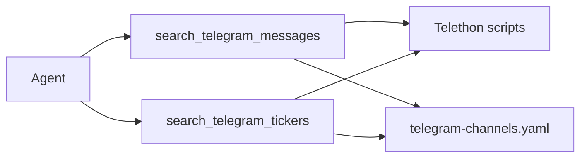

# Telegram Message Search MCP

**Repo:** [`continuum-node-sdk`](../../) — two MCP tools in [`register.ts`](../../src/mcp/register.ts). Ships with the normal node MCP update.

**Scope:** public channels; full message bodies; text search + ticker/token scan. No Apify, no bot-admin indexing.

---

## Architecture



---

## MCP tools

### `search_telegram_messages`

Free-text / regex search (unchanged).

| Parameter | Default | Description |
|-----------|---------|-------------|
| `query` | required | Term or regex |
| `channels` | YAML | Channel usernames |
| `max_results` | 50 | Cap; **most recent first** |
| `max_messages_per_channel` | 500 | Scan depth |
| `regex` | false | Regex mode |
| `since` | — | ISO date filter |

Returns: `{ channel, message_id, text, posted_at, url }[]` sorted by `posted_at` desc.

---

### `search_telegram_tickers`

Find posts mentioning token/ticker symbols.

| Parameter | Default | Description |
|-----------|---------|-------------|
| `tickers` | YAML `tickers` | Allowlist; **empty = any detected ticker** |
| `channels` | YAML `channels` | Channel usernames |
| `max_results` | 50 | Cap; **most recent first** |
| `max_messages_per_channel` | 500 | Scan depth |
| `since` | — | ISO date filter |

Returns: `{ channel, message_id, text, posted_at, url, matched_tickers[] }[]` sorted by `posted_at` desc.

**Allowlist behaviour:**

- **`tickers` non-empty** (YAML or param): return posts that mention **any** listed symbol (match with or without `$` / `#` prefix).
- **`tickers` empty** (`[]` or omitted): scan posts and return any message containing **at least one** symbol that passes detection rules below; `matched_tickers` lists what was found.

Tool param overrides YAML when provided.

---

## Ticker detection

Telegram crypto posts use three common forms. Detect in this priority:

| Form | Pattern | Confidence |
|------|---------|------------|
| **Cashtag** | `$` + symbol | High — e.g. `$ETH`, `$UNI` |
| **Hashtag ticker** | `#` + symbol | Medium — e.g. `#bitcoin` (may be topic tags) |
| **Bare caps** | uppercase token alone | Low — needs length + blocklist |

**Symbol grammar** (normalized to uppercase, no `$`/`#` in output):

- `[A-Z][A-Z0-9]{min_len-1,max_len-1}` — default **2–10** chars (YAML-configurable)
- Must start with a letter; digits allowed after first char (`OP`, `ETH2` ok)

**Bare caps rules** (reduce false positives):

- Only consider `\bSYMBOL\b` with word boundaries
- Reject symbols in **`ticker_exclude`** blocklist (bundled defaults: `THE`, `AND`, `FOR`, `NOT`, `YOU`, `ALL`, `NEW`, `USD`, `API`, `CEO`, `DAO`, `TVL`, `APR`, `APY`, `EVM`, `NFT`, `UTC`, `GMT`, `AI`, … — extend in YAML)
- Optional YAML flag **`ticker_include_bare_caps`** (default `true`); when `false`, only `$` and `#` forms count

**Matching allowlist entry `UNI`:** hit on `$UNI`, `#UNI`, or bare `UNI` (if bare caps enabled and passes blocklist).

**Open detection (`tickers: []`):** extract all symbols matching cashtag, hashtag, and bare rules from each message; include post if `matched_tickers` is non-empty.

Implementation: shared `extract_tickers(text, config) -> string[]` in Python (used by `scan_tickers.py`); mirror logic in TS unit tests for regression.

---

## YAML config

[`src/mcp/resources/telegram-channels.yaml`](../../src/mcp/resources/telegram-channels.yaml):

```yaml
defaults:
  max_results: 50
  max_messages_per_channel: 500

# Optional allowlist — empty [] = return all posts with any detected ticker
tickers:
  - ETH
  - UNI
  - BTC

ticker_detection:
  min_length: 2
  max_length: 10
  include_bare_caps: true
  exclude:
    - THE
    - TVL
    - APR

channels:
  - username: defillama
    category: analytics
  - username: uniswap
    category: dex
```

---

## New files

```
src/core/agent/telegram-search.ts
src/mcp/agent-telegram-search.ts
src/mcp/resources/{agent-telegram-search.md,telegram-channels.yaml}
scripts/telegram-search/
  create_session.py
  search_public_channels.py    # text query → Telethon search=query
  scan_tickers.py              # paginate messages, extract/filter tickers
  ticker_extract.py            # shared detection logic
  requirements.txt
test/agent-telegram-search.test.ts
test/ticker-extract.test.ts    # or Python pytest for ticker_extract
```

**Scan flow (`scan_tickers.py`):**

1. For each channel, `iter_messages(limit=max_messages_per_channel)` (no Telethon `search=` — we filter client-side for tickers).
2. Apply `since` filter.
3. Run `extract_tickers`; if allowlist set, keep messages where intersection non-empty; else keep if any ticker found.
4. Collect matches, **sort by `posted_at` desc**, truncate to `max_results`.
5. JSON stdout.

---

## Operator setup (brief)

1. **my.telegram.org** → `TELEGRAM_API_ID`, `TELEGRAM_API_HASH` in Node Variables.
2. **`create_session.py`** once → `TELEGRAM_SESSION_PATH`.
3. Edit **`tickers`** in YAML (or leave `[]` for open scan). Call `search_telegram_tickers` or ask the agent.

---

## Examples

**Text search:**
```json
{ "query": "Uniswap v4 hook", "max_results": 20 }
```

**Ticker allowlist (YAML or param):**
```json
{ "tickers": ["ETH", "UNI"], "max_results": 30 }
```

**Open ticker scan (YAML `tickers: []`):**
```json
{ "max_results": 50 }
```

---

## Implementation steps

1. YAML loader (channels, tickers, detection config)
2. `ticker_extract.py` + tests
3. `scan_tickers.py` + `search_public_channels.py`
4. SDK + both MCP tools + schemas
5. Brief agent doc
6. Smoke test both tools

---

## Risks

- Bare caps produce false positives — tune `exclude` and `include_bare_caps`
- Open scan (`tickers: []`) is noisier than allowlist
- Ticker scan paginates without Telethon text search — deeper scans cost more API time; cap `max_messages_per_channel`

---

## Phase 2

- Seed `tickers` from node token registry
- GramJS (drop Python)
- Cron ticker digest via `telegramNotify`
